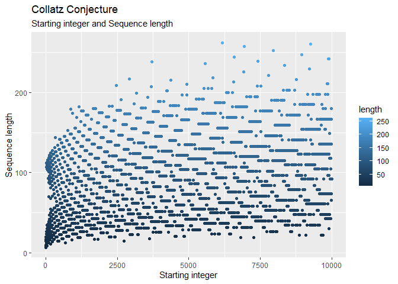
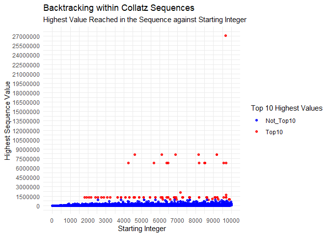
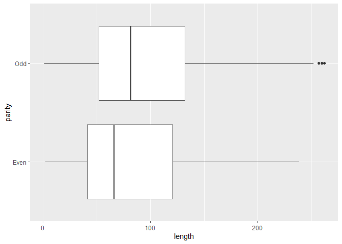

FeedMePi Group Assignment
================

## Contributions

- Task 1: @Sia Yee Zee, @AqilMN
- Task 2: @izzati-aziz
- Task 3: @AqilMN
- Task 4: @Sia Yee Zee, @AqilMN, @izzati-aziz
- Task 5: @izzati-aziz
- Task 6: @Sia Yee Zee
- README: @AqilMN

## Tasks

### 1) Generating the Collatz Conjecture

Creating a function called `gen_collatz` that takes a positive integer
`n` and generates the Collatz sequence.

``` r
gen_collatz <- function(n) {
  if (n != as.integer(n) | n < 1) {
    stop("Input n is invalid!")
  }
  gen <- function(n) {
    if (n %% 2 == 0){
      return(n/2)
    } else (n %% 2 != 0) 
    return(3 * n + 1)
  }
  
  n_seq <- n
  if (n == 1) {
    n_seq <- c(1)
  } else {
    while (n != 1) {
      n <- gen(n)
      n_seq <- c(n_seq, n)
    }
  }
  return(n_seq) 
}
```

There is a safeguard implemented for if `n` is less than 1 or not an
integer:

`if (n != as.integer(n) | n < 1) {     stop("Input n is invalid!")   }`

Applying all integers from 1 to 10,000 to the function. Then creating a
tibble named `collatz_df`, which contains the starting integer (`start`)
and the Collatz sequence (`seq`)

``` r
n <- c(1:10000)
result_n <- lapply(n, gen_collatz) 

collatz_df <- tibble(
  start = n,
  seq = result_n
)

collatz_df
```

    ## # A tibble: 10,000 × 2
    ##    start seq       
    ##    <int> <list>    
    ##  1     1 <dbl [1]> 
    ##  2     2 <dbl [2]> 
    ##  3     3 <dbl [8]> 
    ##  4     4 <dbl [3]> 
    ##  5     5 <dbl [6]> 
    ##  6     6 <dbl [9]> 
    ##  7     7 <dbl [17]>
    ##  8     8 <dbl [4]> 
    ##  9     9 <dbl [20]>
    ## 10    10 <dbl [7]> 
    ## # ℹ 9,990 more rows

By using the mutate function, we add columns for the length of the
sequence (`length`), whether the starting integer is even or odd
(`parity`) and the maximum value reached in the sequence (`max_val`)

``` r
collatz_df <- mutate(.data = collatz_df,
                     length = as.double(sapply(seq, length)),
                     parity = case_when(start %% 2 == 0 ~ 'Even',
                                        start %% 2 != 0 ~ 'Odd'),
                     max_val = sapply(seq, max)
)

collatz_df
```

    ## # A tibble: 10,000 × 5
    ##    start seq        length parity max_val
    ##    <int> <list>      <dbl> <chr>    <dbl>
    ##  1     1 <dbl [1]>       1 Odd          1
    ##  2     2 <dbl [2]>       2 Even         2
    ##  3     3 <dbl [8]>       8 Odd         16
    ##  4     4 <dbl [3]>       3 Even         4
    ##  5     5 <dbl [6]>       6 Odd         16
    ##  6     6 <dbl [9]>       9 Even        16
    ##  7     7 <dbl [17]>     17 Odd         52
    ##  8     8 <dbl [4]>       4 Even         8
    ##  9     9 <dbl [20]>     20 Odd         52
    ## 10    10 <dbl [7]>       7 Even        16
    ## # ℹ 9,990 more rows

### 2) Exploratory data analysis

##### 1. The top 10 starting integers that produce the longest sequences

Saved as `top10longest`

``` r
top10longest <- collatz_df %>%
                arrange(desc(length), .by_group = TRUE) %>%
                slice(1:10, .by =  NULL) %>%
                select(start) %>%
                unlist()

top10longest
```

    ##  start1  start2  start3  start4  start5  start6  start7  start8  start9 start10 
    ##    6171    9257    6943    7963    8959    6591    9887    9897    7422    7423

##### 2. The starting integer which produces a sequence that reaches the highest maximum value

Saved as `max_val_int`

``` r
max_val_int <- collatz_df %>%
               arrange(desc(max_val), .by_group = TRUE) %>%
               slice(1:1, .by = NULL, .preserve = FALSE) %>%
               select(start) %>%
               unlist()

max_val_int
```

    ## start 
    ##  9663

##### 3. The average length and standard deviation of the sequence for even starting integers compared to odd ones

The average length of the sequences for even and odd starting integers,
saved as `even_odd_avg_len`

``` r
even_odd_avg <- collatz_df %>%
                       group_by(parity) %>% 
                       summarise(avg = mean(length)) %>%
                       select(avg)
  
even_odd_avg_len <- even_odd_avg$avg 

even_odd_avg_len
```

    ## [1] 79.5936 92.3396

The standard deviation of the length of the sequences for even and odd
starting integers, saved as `even_odd_sd_len`

``` r
even_odd_sd <- collatz_df %>%
                    group_by(parity) %>%
                    summarise(sd = sd(length)) %>%
                    select(sd)

even_odd_sd_len <- even_odd_sd$sd

even_odd_sd_len
```

    ## [1] 45.10308 47.18387

### 3) Investigating “backtracking” in sequences

Backtracking is when a sequence reaches a value that is less than the
starting integer, but then increases again above the starting integer at
least once before reaching 1.

##### 1. Retain starting integers that exhibit backtracking in their sequences

Modifying the function from **Task 1**. By changing the function name to
`gen_back` and adding a for loop with the conditions for sequences that
backtrack. The function returns sequences that backtrack, and returns
“NULL” for the sequences that do not backtrack.

``` r
gen_back <- function(n) {
          ...
          ...
          ...
    while (n != 1) {
      n <- gen(n)
      n_seq <- c(n_seq, n)
    }
  }
  for (i in 2:length(n_seq)) {
    if (isTRUE(n_seq[1] > n_seq[i] & n_seq[1] < n_seq[i+1]) == TRUE){
      return(n_seq)
    }
  } 
}
```

Obtaining `backtracks_df` by creating a tibble using the function,
filtering out “NULL” and adding the columns `length`, `parity` and
`max_val`.

``` r
n <- c(1:10000)
result_back <- lapply(n, gen_back)

backtracks_df <- tibble(
  start = n,
  seq = result_back
) %>%
  filter(seq != "NULL") %>%
  mutate(length = as.double(sapply(seq, length)),
         parity = case_when(start %% 2 == 0 ~ 'Even',
                            start %% 2 != 0 ~ 'Odd'),
         max_val = sapply(seq, max))

backtracks_df
```

    ## # A tibble: 8,229 × 5
    ##    start seq        length parity max_val
    ##    <int> <list>      <dbl> <chr>    <dbl>
    ##  1     6 <dbl [9]>       9 Even        16
    ##  2     7 <dbl [17]>     17 Odd         52
    ##  3     9 <dbl [20]>     20 Odd         52
    ##  4    10 <dbl [7]>       7 Even        16
    ##  5    11 <dbl [15]>     15 Odd         52
    ##  6    12 <dbl [10]>     10 Even        16
    ##  7    13 <dbl [10]>     10 Odd         40
    ##  8    14 <dbl [18]>     18 Even        52
    ##  9    15 <dbl [18]>     18 Odd        160
    ## 10    17 <dbl [13]>     13 Odd         52
    ## # ℹ 8,219 more rows

##### 2. Most frequently occuring number of times sequences that backtrack go above their starting integer

Modifying the function from **Task 3 Part 1**. By changing the function
name to `gen_back_seq` and adding a for loop with the conditions
sequences that backtrack. The function returns parts of sequences that
experiences backtracking and returns “NULL” for the sequences that do
not backtrack.

``` r
gen_back_seq <- function(n) {
          ...
          ...
          ...
  n_seq3 <- c()
  for (i in 2:length(n_seq)) {
    if (isTRUE(n_seq[1] > n_seq[i] & n_seq[1] < n_seq[i+1]) == TRUE){
      b <- n_seq[i]
      t <- n_seq[i+1]
      
      n_seq2 <- c(b,t)
      n_seq3 <- c(n_seq3, n_seq2)
    }
  } 
  return(n_seq3)
}
```

Obtaining `back_seq_df` by creating a tibble using the function and
filtering out “NULL”, then unnesting and filtering sequence numbers that
are higher than starting integers.

``` r
result_back_seq <- lapply(n, gen_back_seq)

back_seq_df <- tibble(
  start = n,
  seq = result_back_seq
)

back_seq_df <- tibble(
  start = n,
  seq = result_back_seq
) %>%
  filter(seq != "NULL") %>%
  unnest(seq) %>%
  filter(seq > start)
```

Creating a frequency table (`start_freq`) of starting integers and the
number of sequence values that go above starting integer.

``` r
start_freq <- as.data.frame(table(back_seq_df$start))
```

Creating a function to find mode. `my_mode`

``` r
my_mode <- function(x) {                      
  unique_x <- unique(x)
  tabulate_x <- tabulate(match(x, unique_x))
  unique_x[tabulate_x == max(tabulate_x)]
}
```

Obtaining `mode_backtrack` by applying `my_mode` function to
`start_freq`.

``` r
mode_backtrack <- as.integer(my_mode(start_freq$Freq))

mode_backtrack
```

    ## [1] 1

##### 3. Maximum Value After First Backtrack for the sequences

Creating a function that returns maximum value after first backtrack.

``` r
gen_back_max <- function(n) {
          ... 
          ... 
          ...
    while (n != 1) {
      n <- gen(n)
      n_seq <- c(n_seq, n)
    }
  }
  for (i in 2:length(n_seq)) {
    if (isTRUE(n_seq[1] > n_seq[i] & n_seq[1] < n_seq[i+1]) == TRUE){
      return(max(n_seq[-(0:i+1)]))
    }
  } 
}
```

Obtaining `back_max_df` by creating a tibble and filtering out “NULL”

``` r
result_back_max <- lapply(n, gen_back_max)

back_max_df <- tibble(
  start = n,
  max = result_back_max
) %>% 
  filter(max != "NULL")
```

Obtaining `max_after_backtrack` by coercing the max values in
`back_max_df` into a vector.

``` r
max_after_backtrack <- unlist(back_max_df$max)

max_after_backtrack
```

``` r
##    [1]      16       8      52       8       8       8       8      52       8
##   [10]      20      52      52      52      88      20     160      52      52
##   [19]     160     160      88      40      40      40      88      88    9232
##   [28]      32      56      40      40     160     160      56      88      52
##   [37]    9232    9232     196      52      52     160     160    9232     160
##   [46]     112      88      52     160     160    9232      56      52      52
##   [55]     304      52     160    9232    9232     196      56     304      68
##   [64]     160     160     160    9232    9232    9232     112     232     160
##   [73]     808      80    9232    9232    9232    9232     160     128     196
##   [82]     148     304     152      80    9232     160     304    9232    9232
##   [91]    9232     116    9232     148     304     148    9232     104     304
##  [100]      80      80    9232    9232    9232    9232    9232     340     520
##  [109]     116     160     304     304     808     160    9232     184    9232
##  [118]    9232    9232     160    4372     128    9232     148     148     592
##  [127]    9232     200     304     152    9232    9232     628     160     808
##  [136]    9232    9232    9232     116    9232    9232    9232     448    9232
##  [145]    1024     152     116     116    9232    9232     304     808     808
##  [154]    9232    9232    9232     736    9232     472    9232    9232    9232
##  [163]    4372     256     520    9232    9232     176    9232     304     304
##  [172]     808     272    9232    9232     628     472    9232     952    9232
##  [181]    9232    9232    4372     308    9232    9232    9232     592    9232
##  [190]    9232     200     256     152     152     916     308    9232    9232
##  [199]     628     152     952     212    9232    9232    9232     308     736
##  [208]    9232    9232    9232    9232    9232     952    9232     224    9232
##  [217]     256     256    1024     344     520     260    9232    9232    9232
##  [226]     304     808     808    9232     544    9232    9232     736    9232
##  [235]    9232    1672    9232    9232    9232    9232    9232    9232    4372
##  [244]    4372    9232    9232    9232     260    9232     592     592    9232
##  [253]    9232    9232     400     808     488    2752     272    1384    9232
##  [262]    9232    9232     592     416     628     472     952     808    9232
##  [271]    9232    9232    2752    9232    9232    4372     308     736    9232
##  [280]    9232    9232    9232    9232    9232    2248     296    9232     224
##  [289]     224    9232    9232     452    1024    1024     916    1384     308
##  [298]    9232    9232    9232    9232    9232    9232     472     808     808
##  [307]     952    1024    9232     320    2752    9232    9232    9232     308
##  [316]    9232     488     736     368    9232    9232    1672    1672    9232
##  [325]    1492    9232     952    9232    9232    9232     260    9232    4372
##  [334]    4372    1024     976    9232     344    9232     260     260    9232
##  [343]    9232     592    9232    9232    9232    9232    1600     356     808
##  [352]     808    9232     976    2752     544    9232    9232    9232    9232
##  [361]    4192     368    9232     628     628    1672    9232    9232     560
##  [370]     952     952    9232    9232    9232    9232    9232    2752    9232
##  [379]     272    4372    4372   13120     260     868    9232    9232    9232
##  [388]    9232    9232    1672    9232     392    9232     296     296    9232
##  [397]    9232     596    9232    9232    1204    1816     404     976     916
##  [406]     916    2752    9232    1384     616    9232    9232    9232     296
##  [415]    9232     416     704     472     472    1888    2752     808     952
##  [424]     808    9232    9232    9232    2752    9232    9232    9232    4372
##  [433]     308     976     736     368    9232    9232    9232    9232    2968
##  [442]    9232    9232    9232    9232    2248     952    9232    9232    9232
##  [451]    9232    9232    4372     452    1384    1024    1024    3076    1300
##  [460]    9232     688    1384    1672    9232     464    9232    9232    9232
##  [469]    9232    9232     704    9232    9232    1600     800     404    3616
##  [478]     808    1024    9232    9232    9232    9232    2752     724    9232
##  [487]    9232    9232    9232     488    9232     368     368    9232    9232
##  [496]    9232     740    1672    1672    9232    9232    1492    9232    2248
[ reached getOption("max.print") -- omitted 7725 entries ]
```

##### 4. Frequency counts for even and odd backtracking integers

Subset the parity column of `backtracks_df` and making a frequency table
out of it. Then subset that by `Freq`.

``` r
even_odd_backtrack <- as.data.frame(table(backtracks_df$parity))$Freq

even_odd_backtrack
```

    ## [1] 3943 4286

### 4) Visualisations

Creating appropriate graphs that visualise the data wrangling tasks in
**Task 3**.

##### 1. Scatterplot of sequence lenths, with starting integer on the horizontal axis and the length of the sequence on the vertical axis.

Identifying the top 10 starting integers with highest length

``` r
top_10_startint <- backtracks_df %>%
  arrange(desc(length)) %>%
  group_by(length) %>%
  slice(1:10)
```

``` r
ggplot(data = backtracks_df,
       mapping = aes(x = start,
                     y = length )) +
  geom_point(data = top_10_startint, 
             aes(x = start,
                 y = length,
                 col = length)) +
  labs(
    title = "Collatz Conjecture",
    subtitle = paste(
      "Starting integer and Sequence length"),
    x = "Starting integer",
    y = "Sequence length"
  )
```

<!-- -->

##### 2. Scatterplot with starting integer on the horizontal axis and the highest value reached in sequence on the vertical axis

<!-- -->

##### 3. Boxplot comparing the distributions of sequence lengths for even and odd starting integers.

``` r
ggplot(data = collatz_df ,
       mapping =  aes( x = length, 
                       y = parity)) +
geom_boxplot()
```

<!-- -->

### 5) Open-ended exploration

Does odd numbers produce longer sequences?

``` r
top20longest <- collatz_df %>%
                arrange(desc(length), .by_group = TRUE) %>%
                slice(1:20, .by =  NULL) %>%
                select(start, parity) 

top20longest
```

    ## # A tibble: 20 × 2
    ##    start parity
    ##    <int> <chr> 
    ##  1  6171 Odd   
    ##  2  9257 Odd   
    ##  3  6943 Odd   
    ##  4  7963 Odd   
    ##  5  8959 Odd   
    ##  6  6591 Odd   
    ##  7  9887 Odd   
    ##  8  9897 Odd   
    ##  9  7422 Even  
    ## 10  7423 Odd   
    ## 11  3711 Odd   
    ## 12  5567 Odd   
    ## 13  8351 Odd   
    ## 14  9225 Odd   
    ## 15  6919 Odd   
    ## 16  7785 Odd   
    ## 17  5838 Even  
    ## 18  5839 Odd   
    ## 19  2919 Odd   
    ## 20  8758 Even

When arranged based on the length of the sequence, it is shown that 17
out of 20 of the longest sequence has odd number as the starting
integer.
